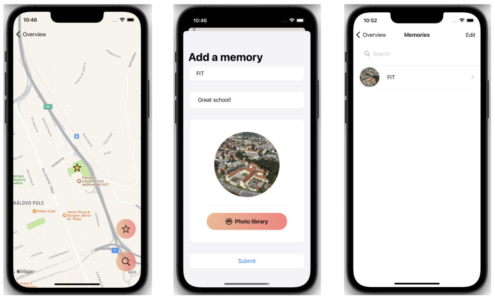
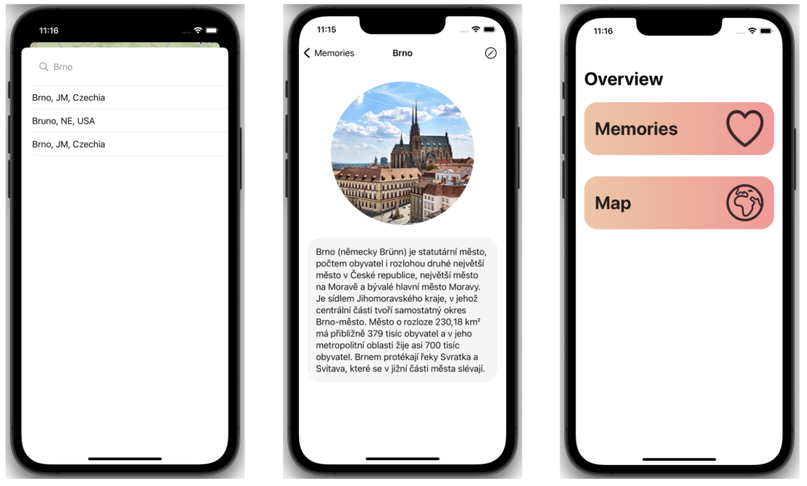

# Memory Map
**Author**: Vladislav Khrisanov

*This file contains a brief description of the application and its implementation.*

# Idea
**Memory Map** is a simple yet powerful tool for keeping your favourite memories in one place.

The map allows you to put small annotations to remind you of dear moments, places and people alike.

A single annotation includes a name, a photo and a form for your thoughts.

# Implementation details
The data are persisted via **Apple CoreData** framework.

For the map functionality the two tools were used. **Apple Map kit** for providing the map itself and the simple free map API called **Positionstack** for managing the search and navigation.

Data are fetched from API using `JSONDecoder()`. Received coordinates are passed into the map to change the location or to set the annotation in the appropriate place.

